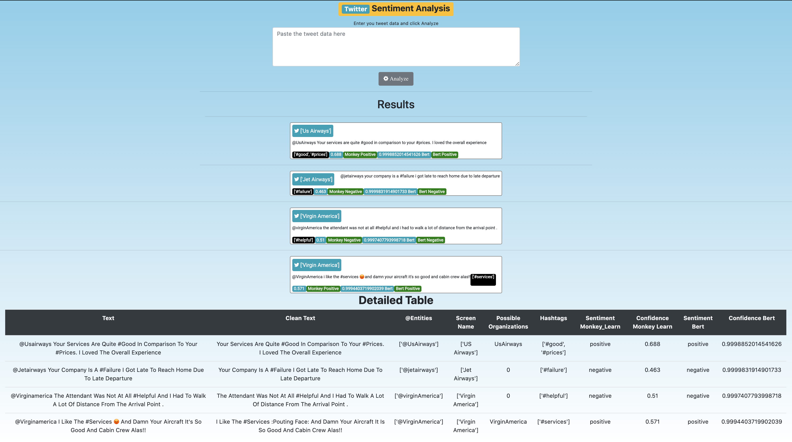
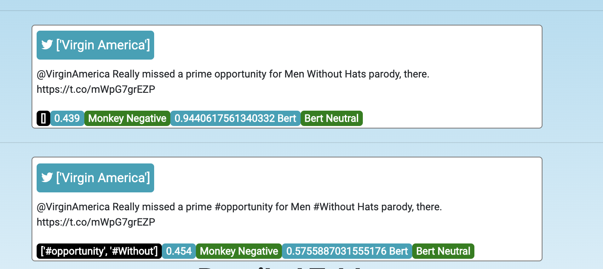

<strong><h1># G1_TwitterSentimentAnalysis</h1></strong> 

The goal of this project is to train and obtain a classification model which can classify tweets on their sentiment it portrays.
The dataset used for training and validation here was of users tweeting for US Based Airlines
The project was completed under Mr. Akshay Gugnani under a timespan of 30 Days

<strong><a href = "https://www.linkedin.com/in/kush-kumar-139084183/">Kush Kumar</a></strong> 

# Twitter-Sentiment-Analysis
# Certificate
<strong><a href = "https://github.com/kush-koderrex/Twitter-Sentiment-Analysis-Kush/blob/master/kush%20internship%20certificate.pdf">Certificate</a></strong> 
